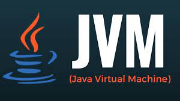

# JVM学习笔记

## memory jvm内存相关技术

### chapter2  类加载子系统

### chapter4  虚拟机栈

### chapter6  堆空间

- com.zy.demo1 简单测试代码
- com.zy.oom OutOfMemory举例
- com.zy.yo 新生代和老年代内存占比测试
- com.zy.dgc 代码举例与JVisualVM演示对象
- com.zy.gc_log 观察Minor GC、Major GC以及Full GC日志信息

### chapter7 方法区

- com.zy.oom OutOfMemory举例

# garbage_collection JVM垃圾回收

## algorithm  垃圾回收算法相关

- ref_count_gc 测试引用计数垃圾回收

# bytecode class字节码

## byte_code_parse 《Java虚拟机字节码》读书笔记 实现一个class字节码解析器

# classloader 类加载相关

- demo2 热替换的代码实现

